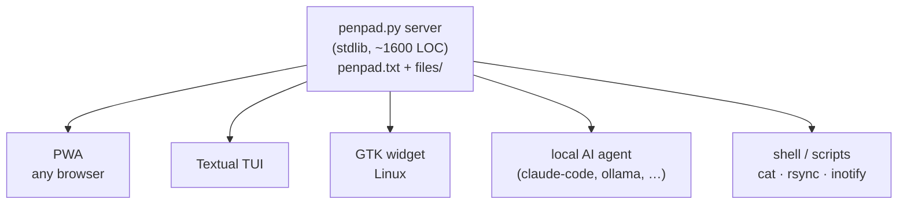

<p align="center">
  
</p>

# penpad

**A notes and file sharing app for you and your agents.**

Self-hosted, instant, no accounts. Drop a file on one of your devices
and it's on another a beat later. No iCloud, no Apple ecosystem, no
subscription, no discovery handshake — works between devices AirDrop
won't even talk to (Linux ↔ iPhone, Android ↔ Mac, headless server ↔
anything).

The data is a single text file plus a single folder on your disk; you
can `cat` or `rsync` it.

<p>
  
  
  
</p>

## Why I built it

I have multiple machines, multiple agent harnesses, and I'm constantly
SSH'd or VNC'd across them to keep certain workspaces isolated. Half
the time I'm talking to an agent that lives on a different machine
than the one I'm physically using. Moving a file or pasting text
between those contexts was death by a thousand cuts: scp this,
base64-paste-decode that, screenshot-then-rephotograph the other
thing. penpad is the one place all of them can see.

## What it is

A shared textarea and a shared folder, served by one small Python
process. Every client hits the same data:



Three first-class GUI clients: a PWA (any browser, installs to
iOS/Android home screen), a Textual TUI, and a GTK desktop widget for
Linux. **A local AI agent on the same host is a fourth client** — it
just reads and writes the same file and folder, no API key, no OAuth,
no tool-use schema. So is `cat`, `rsync`, `inotifywait`, and any
script you write.

## What you'd use it for

- **Hand a file to an agent on another machine.** Drop it; the agent
  picks it up.
- **Get a URL or text blob back from an agent.** Same primitive,
  other direction.
- **Move a screenshot from your phone to your laptop** — under a
  second, no AirDrop quirks, works between any platforms.
- **Park something for yourself** to grab later from any of your
  devices.
- **Run a quick back-and-forth** with a local agent by appending
  lines to the pad — no schema, no protocol. (penpad isn't a chat
  app; it just happens to fit one in zero LOC.)

Same shape every direction. Simple, fast, secure.

## Mental model: one user, many clients

penpad is **deliberately single-user**: one person, many devices, many
agents, all bound by a tailnet (or LAN, or VPN). No multi-user auth,
no sharing mode, no ACLs.

That single constraint is what lets the whole thing stay tiny and feel
instant. Security lives at the **network layer** — you put penpad
somewhere only your stuff can reach, and "open the URL" is the whole
login. Add a device to your tailnet and it's automatically trusted.

If you want multi-user, encrypted-at-rest, or public-internet
hosting, use a different tool. penpad is a primitive, not a platform.

## How it feels

Typing saves in the background 400 ms after your last keystroke. Other
clients pick up the new text within ~2 s via an `X-Rev` header poll.
Uploads stream with a progress bar that tracks the whole batch.
There's no "save" button, no "sync now" indicator, no conflict modal
— it just behaves like the same textarea is open on every device.

## Requirements

- **Python 3.10+** for the server, TUI, and widget code (uses
  `str | None` PEP 604 syntax).
- **Linux + GTK 3 + WebKit2 4.1** for the desktop widget only (the
  server, web UI, and TUI work anywhere Python does).

## Quick start

```sh
git clone https://github.com/akakabrian/penpad.git ~/penpad
cd ~/penpad
python3 penpad.py
```

Browse to `http://<host>:8767/`. That's it — data lives in
`~/penpad/penpad.txt` and `~/penpad/files/`.

### Run the server as a systemd user service

```sh
mkdir -p ~/.config/systemd/user
cp packaging/penpad.service ~/.config/systemd/user/
systemctl --user daemon-reload
systemctl --user enable --now penpad.service
```

### Install the TUI

```sh
python3 -m venv ~/penpad/.venv
~/penpad/.venv/bin/pip install -r requirements.txt

# one-liner launcher
mkdir -p ~/.local/bin
printf '#!/usr/bin/env bash\nexec %s/penpad/.venv/bin/python %s/penpad/tui.py "$@"\n' "$HOME" "$HOME" > ~/.local/bin/penpad
chmod +x ~/.local/bin/penpad
```

Run it:
```sh
penpad                                         # local
PENPAD_URL=https://host.example.com penpad     # remote
```

### Install the widget (Linux / GTK)

```sh
sudo apt install python3-gi gir1.2-gtk-3.0 gir1.2-webkit2-4.1
cp packaging/penpad-widget.desktop ~/.config/autostart/
```

Log out and back in; the widget autostarts in the bottom-right corner.
Drag files into it to upload. Click it to bring it forward. The minus
button collapses to a pen-dot; click the pen-dot to expand.

### HTTPS without running a public service

Tailscale Serve gives you a real Let's Encrypt cert on a private
`*.ts.net` MagicDNS name, reachable only from your tailnet:

```sh
tailscale serve --bg --https=443 http://localhost:8767
```

## Using penpad with AI agents

Agents read and write penpad's data directly. The data is a flat text
file plus a flat folder, so any local agent (Claude Code, an
Ollama-driven script, anything with shell access) can just `cat`,
`echo >>`, and `inotifywait`. No API to wire up.

Three docs ship in the repo so the agent path works out of the box:

- **[AGENTS.md](AGENTS.md)** — universal reference. Locations,
  conventions, HTTP API, examples. Any LLM-powered agent can read it.
- **[CLAUDE.md](CLAUDE.md)** — repo-specific instructions for
  `claude-code`. Auto-loaded when Claude Code runs inside the repo.
- **[.claude/skills/penpad/](.claude/skills/penpad/)** — an
  installable Claude Code skill that teaches Claude to interact with
  penpad from any working directory:

  ```sh
  mkdir -p ~/.claude/skills
  cp -r .claude/skills/penpad ~/.claude/skills/
  ```

  After that, ask Claude things like "drop this in penpad" or "check
  what's in my penpad" and it'll use the skill.

## TUI keybindings

| key      | action                                  |
|----------|-----------------------------------------|
| type     | edit pad (autosaves after 400 ms)       |
| tab      | move focus between pad / files / filter |
| `/`      | filter files                            |
| `c`      | copy file URL to clipboard              |
| `d`      | download selected file to `~/Downloads` |
| `o`      | open `~/Downloads/` in file explorer    |
| `x`      | delete selected file from the server    |
| `^r`     | reload state from server                |
| `?`      | help                                    |
| `^q`     | quit                                    |

Pasting an absolute path (or `file://...`) while the files pane is
focused prompts to upload it. Pastes into the pad go in as text.

## Configuration

All clients honor a single env var:

| var          | default                  | purpose                |
|--------------|--------------------------|------------------------|
| `PENPAD_URL` | `http://127.0.0.1:8767`  | which server to talk to |

The widget reads a few extras (with sensible defaults):

| var                | purpose                                          |
|--------------------|--------------------------------------------------|
| `PENPAD_ANCHOR`    | corner: `bottom-right` / `bottom-left` / ...     |
| `PENPAD_W`         | widget width in pixels                           |
| `PENPAD_H`         | widget height in pixels                          |
| `PENPAD_COLLAPSED` | collapsed pen-dot diameter                       |
| `PENPAD_MARGIN`    | gap from the screen edge                         |
| `PENPAD_ON_TOP`    | `1` to force keep-above                          |

The legacy `NOTEPAD_*` names are still accepted as a fallback.

## HTTP API

Tiny, stable, easy to script.

| method | path                       | purpose                                 |
|--------|----------------------------|------------------------------------------|
| GET    | `/content`                 | read the shared text                    |
| POST   | `/save`                    | replace the shared text                 |
| GET    | `/files/`                  | list files (JSON)                       |
| GET    | `/files/<name>`            | fetch a file (supports `Range`)         |
| GET    | `/files/<name>?download=1` | force `Content-Disposition: attachment` |
| PUT    | `/files/<name>`            | upload a file                           |
| DELETE | `/files/<name>`            | delete a file                           |
| POST   | `/upload-uri`              | server-side copy from `file://` URIs (loopback only) |

`GET /content` returns an `X-Rev` header; clients poll it cheaply to
detect changes.

## Security

**Designed for trusted networks — a LAN, a VPN, or a tailnet. Don't
expose it to the public internet.** There is no authentication; anyone
who can reach the port can read, write, and delete. That's the
deliberate trade.

## Contributing

PRs welcome. A few design rules worth knowing:

- The server stays stdlib-only.
- All clients (PWA, widget, TUI) keep the same behavior for **copy
  URL / download / delete / upload**. Don't let them drift.
- The warm-dark palette (see top of `penpad.py` and `tui.tcss`) is
  the project's visual identity. Change it on purpose, not by
  accident.
- penpad is single-user by design. Don't add multi-user auth, ACLs,
  or sharing modes — those belong in a different project.

## License

MIT — see [LICENSE](LICENSE).
