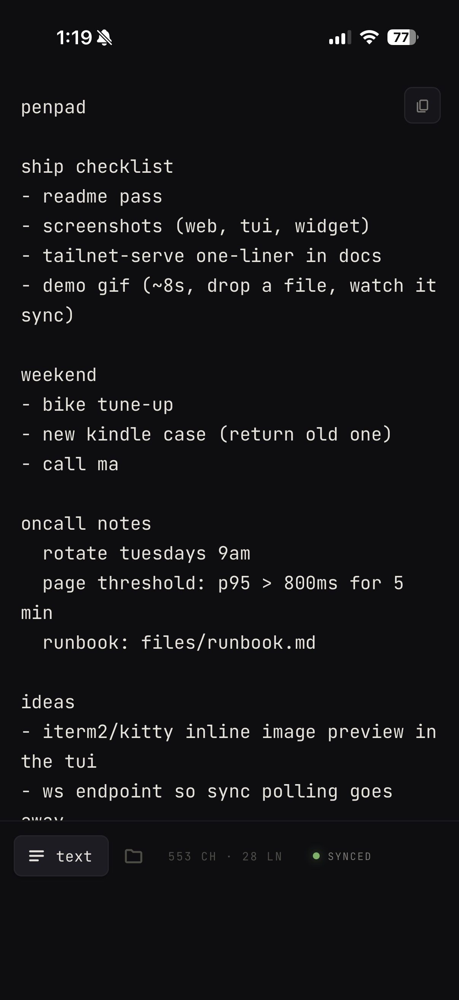
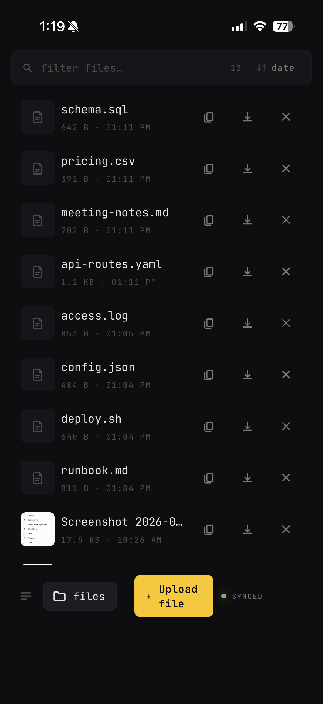
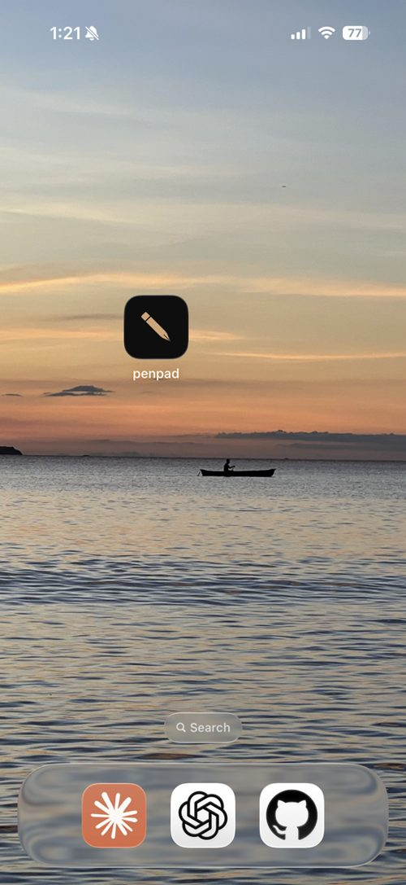

<p align="center">
  
</p>

# penpad

**Instant file and text syncing across every device you own — and
every local AI agent running on them.** One tiny Python server, three
clients: a progressive web app for any browser (desktop, iOS, Android),
a terminal UI (Textual), and a pinned desktop widget for Linux.

No accounts. No cloud. No subscription. Data is a text file and a
directory on your own disk; you can read it with `cat`.

## What it is

A shared textarea and a shared folder. That's the whole primitive.

- **The pad** is a single text file. Edit it from any client; changes
  land on disk 400 ms after your last keystroke and are visible on
  every other client a second or two later.
- **The folder** holds whatever you drop in. Any client can upload,
  list, preview, download, or delete. Dropping a file in one place
  makes it appear everywhere else.

Once you have that primitive running on your own network, the uses
are open-ended. A few we actually use it for:

- **Work alongside a local AI agent.** Claude Code on the penpad host
  can read and write the same file and folder you can — drop a
  screenshot from your phone, ask the agent to look at it, get a
  reply typed back into the pad. No API key, no OAuth, no upload.
- **Device-to-device file transfer.** Screenshot on your phone →
  penpad → laptop, in about a second. Replaces AirDrop, the
  upload-to-Drive-and-share-with-yourself dance, and "email it to
  myself."
- **A scratchpad that's actually everywhere.** One textarea across
  phone, laptop, desktop widget, and tmux. Good for anything you'd
  previously keep in Apple Notes, a Slack DM to yourself, or a scrap
  of paper on the desk.
- **Ad hoc clipboards, dumping grounds, handoff queues, code
  snippets, TODOs across contexts, debug artifacts between machines,
  kids' drawing collections, whatever.** It's a shared file and a
  shared folder; treat it as one. You can even hold a simple
  back-and-forth with a local agent just by appending lines — no
  protocol, no schema — though penpad is deliberately not trying to
  be a chat app.

### The feel

Typing saves in the background 400 ms after your last keystroke; every
other client picks up the new text on its next sync tick (a second or
two later). There's no "upload" button, no "sync now" indicator, no
conflict modal — it just behaves like the same textarea is open on
every device.

### No auth, on purpose

penpad has no login, no passwords, no OAuth, no captchas. **Security
is the network itself.** You put penpad on a tailnet (or LAN, or
VPN), and the thing protecting it is the same thing protecting the
SSH server and the database next to it: you can't reach the IP from
outside. Authentication at the network layer means the app stays a
tiny, friction-free folder instead of a login screen.

It also means every device you add to your tailnet is immediately and
automatically "logged in." Just open the URL. That's the whole story.

Works across every platform you own because the UI is a web page.
Works without the internet if your devices can see each other.

## Features

- **Cross-device file drop.** Drop a file in any client — iPhone PWA,
  Android PWA, browser, GTK widget, or TUI — and every other device
  sees it within a couple of seconds. Screenshots, PDFs, photos, logs,
  whatever.
- **Type-and-forget autosave.** 400 ms after your last keystroke,
  your text is on disk. Other clients pick it up on the next poll
  (~2 s), so everything feels like one shared textarea.
- **No auth, on purpose.** No passwords, no OAuth, no captchas.
  Security lives at the network layer — you lock down access by
  putting penpad on a tailnet / LAN / VPN, and every device on that
  network is instantly trusted. Open the URL and you're in.
- **Consistent file actions** across clients: **copy URL / download /
  delete** available everywhere.
- **Image thumbnails and inline previews** (text, PDF, JSON) in the
  web UI; text snippet previews in the TUI.
- **PWA** — add to Home Screen on iOS / Android, installs as a real
  icon and acts like a native app.
- **Textual TUI** with a warm-dark palette, keyboard-first, works
  great over SSH and inside tmux.
- **Linux desktop widget** (GTK 3 + WebKit) with drag-and-drop upload
  and a self-healing watchdog that recovers from wedged drag grabs.
- **Stdlib-only server.** One `python3 penpad.py` and you're done — no
  `pip install`, no database.
- **Agent-friendly.** Pad lives at one flat file, uploads land in one
  flat directory. Any local AI agent or script can read, write, and
  `inotify`-watch it directly.

## Screenshots

<p>
  
  
  
</p>

Left to right: pad view (autosaving), files view (copy / download / delete
per row), and the PWA installed on the iOS home screen.

## Quick start

```sh
git clone https://github.com/akakabrian/penpad.git ~/penpad
cd ~/penpad
python3 penpad.py
```

Browse to `http://<host>:8767/`. That's it — data lives in
`~/penpad/penpad.txt` and `~/penpad/files/`.

### Run the server as a systemd user service

```sh
mkdir -p ~/.config/systemd/user
cp packaging/penpad.service ~/.config/systemd/user/
systemctl --user daemon-reload
systemctl --user enable --now penpad.service
```

### Install the TUI

```sh
python3 -m venv ~/penpad/.venv
~/penpad/.venv/bin/pip install -r requirements.txt

# one-liner launcher
mkdir -p ~/.local/bin
printf '#!/usr/bin/env bash\nexec %s/penpad/.venv/bin/python %s/penpad/tui.py "$@"\n' "$HOME" "$HOME" > ~/.local/bin/penpad
chmod +x ~/.local/bin/penpad
```

Run it:
```sh
penpad                                         # local
NOTEPAD_URL=https://host.example.com penpad    # remote
```

### Install the widget (Linux / GTK)

```sh
sudo apt install python3-gi gir1.2-gtk-3.0 gir1.2-webkit2-4.1
cp packaging/penpad-widget.desktop ~/.config/autostart/
```

Log out and back in; the widget autostarts in the bottom-right corner.
Drag files into it to upload. Click it to bring it forward. The minus
button collapses to a pen-dot; click the pen-dot to expand.

## Using penpad with AI agents

Agents (Claude Code, Ollama-driven scripts, whatever) read and write
penpad's data directly — no API keys, no OAuth, no wrapper protocol.

- **[AGENTS.md](AGENTS.md)** — universal reference. Locations,
  conventions, HTTP API, examples. Any agent can read this.
- **[CLAUDE.md](CLAUDE.md)** — repo-specific instructions for
  `claude-code`. Auto-loaded when Claude Code runs inside the repo.
- **[.claude/skills/penpad/](.claude/skills/penpad/)** — an installable
  Claude Code skill that teaches Claude to interact with penpad from
  any working directory (not just inside the repo):

  ```sh
  mkdir -p ~/.claude/skills
  cp -r .claude/skills/penpad ~/.claude/skills/
  ```

  After that, ask Claude things like "drop this into penpad" or
  "check what's in my penpad" and it'll use the skill.

Short version: when an agent runs on the penpad host, it's a text file
and a folder — `cat`, `ls`, `echo >>`, done. When it runs elsewhere on
your network, same thing through the HTTP API.

## Keybindings

### Web / widget
Mouse-driven; tabs switch between text and files views.

### TUI

| key      | action                                  |
|----------|-----------------------------------------|
| type     | edit pad (autosaves after 400 ms)       |
| tab      | move focus between pad / files / filter |
| `/`      | filter files                            |
| `c`      | copy file URL to clipboard              |
| `d`      | download selected file to `~/Downloads` |
| `o`      | open `~/Downloads/` in file explorer    |
| `x`      | delete selected file from the server    |
| `^r`     | reload state from server                |
| `?`      | help                                    |
| `^q`     | quit                                    |

Pasting an absolute path (or `file://...`) while the files pane is
focused prompts to upload. Pastes into the pad go in as text as you'd
expect.

## Configuration

All clients honor a single env var:

| var           | default                  | purpose                |
|---------------|--------------------------|-------------------------|
| `NOTEPAD_URL` | `http://127.0.0.1:8767`  | which server to talk to |

The widget additionally reads (with sensible defaults):

| var                 | purpose                                          |
|---------------------|--------------------------------------------------|
| `NOTEPAD_ANCHOR`    | corner: `bottom-right` / `bottom-left` / ...     |
| `NOTEPAD_W`         | widget width in pixels                           |
| `NOTEPAD_H`         | widget height in pixels                          |
| `NOTEPAD_COLLAPSED` | collapsed pen-dot diameter                       |
| `NOTEPAD_MARGIN`    | gap from the screen edge                         |
| `NOTEPAD_ON_TOP`    | `1` to force keep-above                          |

## HTTP API

Tiny, stable, easy to script.

| method | path                       | purpose                                 |
|--------|----------------------------|------------------------------------------|
| GET    | `/content`                 | read the shared text                    |
| POST   | `/save`                    | replace the shared text                 |
| GET    | `/files/`                  | list files (JSON)                       |
| GET    | `/files/<name>`            | fetch a file (supports `Range`)         |
| GET    | `/files/<name>?download=1` | force `Content-Disposition: attachment` |
| PUT    | `/files/<name>`            | upload a file                           |
| DELETE | `/files/<name>`            | delete a file                           |
| POST   | `/upload-uri`              | server-side copy from `file://` URIs (loopback only) |

`GET /content` returns an `X-Rev` header so clients can poll cheaply
for changes.

## Security model

**This is designed for trusted networks — a LAN, a VPN, or a tailnet.
Don't expose it to the public internet.** There is no authentication;
anyone who can reach the port can read, write, and delete.

If you want HTTPS + a real cert without running a public service, one
easy path is [Tailscale Serve](https://tailscale.com/kb/1242/tailscale-serve):

```sh
tailscale serve --bg --https=443 http://localhost:8767
```

That gets you a real Let's Encrypt cert on your `*.ts.net` MagicDNS
name, reachable only from your tailnet.

## Architecture

```
                       ┌──────────────┐
                       │   penpad.py  │
                       │ (stdlib HTTP │
                       │    server)   │
                       └──────┬───────┘
                              │
          ┌───────────────────┼───────────────────┐
          │                   │                   │
   ┌──────┴──────┐     ┌──────┴──────┐     ┌──────┴──────┐
   │  web / PWA  │     │  widget.py  │     │   tui.py    │
   │(any browser)│     │ (GTK/WebKit)│     │ (Textual)   │
   └─────────────┘     └─────────────┘     └─────────────┘
```

The server is ~1600 lines of Python stdlib. Text lives in a single file;
files live in a single directory. Back it up with `rsync`.

## Contributing

PRs welcome. A few design rules:

- The server stays stdlib-only.
- The three clients share behavior for copy / download / delete /
  upload. Don't let them drift.
- The warm-dark palette (see top of `penpad.py` and `tui.tcss`) is the
  visual identity. Change it on purpose, not by accident.

## License

MIT — see [LICENSE](LICENSE).
