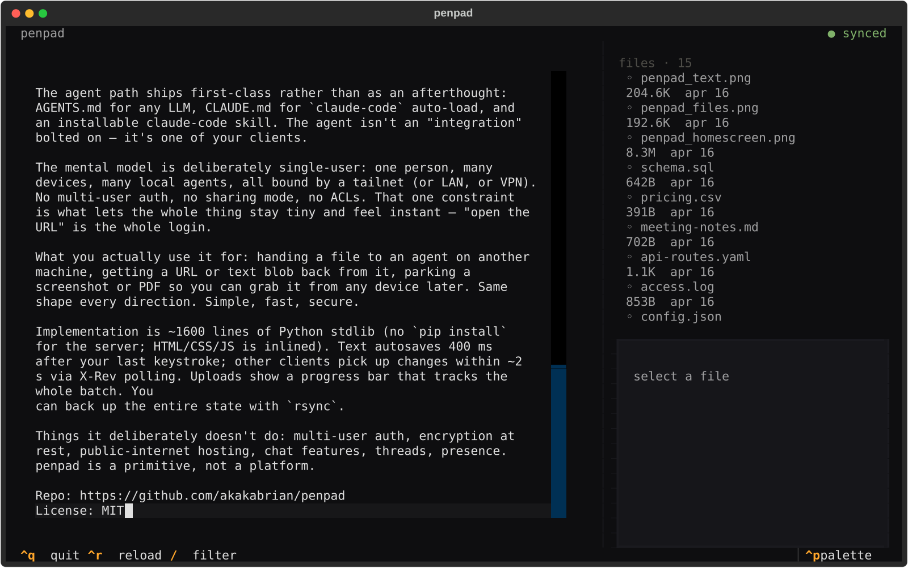
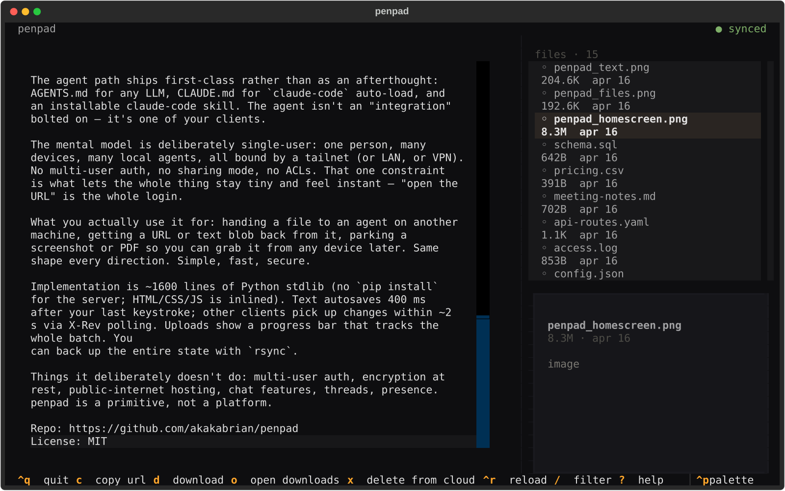
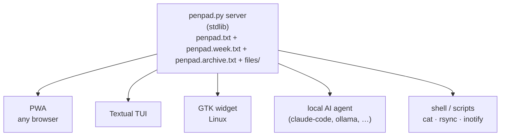

<p align="center">
  
</p>

# penpad

**Version 0.2.0 — a shared notes, file drop, and agent command room for
one person with many devices and many local agents.**

Self-hosted, instant, no accounts. Penpad gives you an editable Today
note, automatic Week and Archive rollups, a shared file drop, and an
append-only chat room where humans and opt-in agent watchers can route
work with `@machine` / `@agent` mentions. Drop a file on one device and
it is on another a beat later; send a directed chat message and only the
matching listener wakes up.

The data is just text files and a folder on your disk; `cat`,
`rsync`, or `git` it however you want.

<p>
  
  
  
</p>
<p>
  
  &nbsp;
  
</p>

## Why I built it

Multiple machines, multiple agent harnesses, constant SSH and VNC
across them. Half the time the agent I'm talking to lives on a
different box than the one I'm sitting at. Moving a file or pasting
text between those contexts was death by a thousand cuts. penpad is
the one place all of them can see.

## What it is

A three-page note pad, shared folder, and directed command room served
by one small Python process. Today is editable; Week and Archive are
read-only rollups. Files are ordinary files. Chat is append-only JSONL.
Agents opt in by running a local watcher.



Three GUI clients (PWA, Textual TUI, GTK widget). **A local AI agent
on the same host is the fourth** — it can read/write files directly,
append to Today over HTTP, or listen for routed chat messages. No API
key, no OAuth, no tool-use schema. Any script you write does the same.

## Features

- **Today / Week / Archive notes.** Type only in Today. At midnight,
  Today rolls into Week. After Sunday, the completed Week rolls into
  Archive and Week starts clean.
- **Shared file drop.** Upload from browser, TUI, or widget; preview
  images, PDFs, media, and wrapped text/Markdown files; download or copy
  URLs from any device.
- **Append-first agent workflows.** `POST /append` and direct file
  access make additive agent replies safer than replacing the whole pad.
- **Directed chat room.** `@machine` / `@agent` mentions, watcher
  presence, replies, pins, toggleable reactions, task states, permalinks,
  and local unread dividers.
- **Opt-in automation.** `scripts/penpad-agent-watch.py` listens only
  for matching mentions and can hand message JSON to a local agent
  harness.
- **Low-friction sync.** Server-Sent Events wake clients quickly, with
  polling fallback for simple clients.
- **Guardrails without accounts.** Optional `PENPAD_TOKEN`, upload/body
  limits, atomic writes, bounded event streams, and memory-capped chat
  reads.

## What you'd use it for

- **Hand a file to an agent on another machine** — drop it; the agent
  picks it up.
- **Send directed work to a specific machine** — write `@mini run the
  smoke test`; only listeners for `mini` react.
- **Get a URL or text blob back** from the agent.
- **Move a screenshot from phone to laptop** in under a second.
- **Park something for yourself** to grab later from any device.
- **Keep daily scratch notes** without manual cleanup; Today, Week, and
  Archive organize themselves.

Same shape every direction. Simple, fast, secure.

## Mental model

**Single-user by design**: one person, many devices, many agents, all
on a tailnet (or LAN, or VPN). No accounts, no multi-user permissions,
no ACLs. Optional token auth protects mutating routes if you need an
extra guardrail, but security is still primarily the network layer.

If you want multi-user, encryption-at-rest, or public hosting, use
something else. penpad is a primitive, not a platform.

## How it feels

Typing in Today saves 400 ms after your last keystroke. Other clients
pick up note, file, chat, and presence changes through `/events` with
polling as fallback. At the Sunday-to-Monday midnight rollover, Today
is appended into Week, then the completed Week is appended into Archive
and Week starts clean. Uploads run through a FIFO queue with progress.
Chat messages are append-only and routable with `@machine` / `@agent`
mentions. No "save" button, no "sync now", no conflict modal.

## Requirements

- **Server / TUI / PWA** — Python 3.10+. No other deps for the
  server itself.
- **Widget** — Linux + GTK 3 + WebKit2 4.1.

## Quick start

```sh
git clone https://github.com/akakabrian/penpad.git ~/penpad
cd ~/penpad
python3 penpad.py
```

Open `http://<host>:8767/`. Type in Today, drop a file, then open
the same URL on your phone — they all sync. Data lives in
`~/penpad/penpad.txt`, `~/penpad/penpad.week.txt`,
`~/penpad/penpad.archive.txt`, `~/penpad/penpad.chat.jsonl`, and
`~/penpad/files/`.

### As a systemd user service

```sh
mkdir -p ~/.config/systemd/user
cp packaging/penpad.service ~/.config/systemd/user/
systemctl --user daemon-reload
systemctl --user enable --now penpad.service
```

### TUI

```sh
python3 -m venv ~/penpad/.venv
~/penpad/.venv/bin/pip install -r requirements.txt

cat > ~/.local/bin/penpad <<EOF
#!/usr/bin/env bash
exec $HOME/penpad/.venv/bin/python $HOME/penpad/tui.py "\$@"
EOF
chmod +x ~/.local/bin/penpad
```

```sh
penpad                                         # local
PENPAD_URL=https://host.example.com penpad     # remote
```

### Widget (Linux/GTK)

```sh
sudo apt install python3-gi gir1.2-gtk-3.0 gir1.2-webkit2-4.1
cp packaging/penpad-widget.desktop ~/.config/autostart/
```

Pinned to the bottom-right after next login. Drag files to upload;
click to raise; minus button → pen-dot, click to expand.

### Agent chat watcher

Chat is a shared command room, but Penpad does not execute work by
itself. Each machine that should react needs to opt in by running a
watcher:

```sh
PENPAD_AGENT=mini python3 scripts/penpad-agent-watch.py --target mini --ack --sse
```

Messages like `@mini start a branch and run tests` wake only watchers
whose targets match. By default the watcher prints matching message
JSON; pass `--exec 'your-local-agent-command'` to hand the message to a
local agent harness on stdin. Watchers announce presence for `@` mention
autocomplete, remember their last seen chat id in
`~/.penpad-agent-watch-<name>.json`, and never execute chat text directly.
The chat UI also supports replies, pinned messages, toggleable quick reactions, and
lightweight task states. Slack-style permalinks can be copied from any
message, and each browser shows a local unread divider until you mark the
room read. Shared actions are append-only metadata messages rather than
edits to old chat rows.

### HTTPS without going public

```sh
tailscale serve --bg --https=443 http://localhost:8767
```

Real Let's Encrypt cert on a private `*.ts.net` name, reachable only
from your tailnet.

## Using penpad with AI agents

Agents read and write the data directly — no API to wire up. Three
docs ship in the repo so the agent path works out of the box:

- **[AGENTS.md](AGENTS.md)** — universal reference (locations,
  conventions, HTTP API, examples).
- **[CLAUDE.md](CLAUDE.md)** — repo-specific instructions auto-loaded
  by `claude-code`.
- **[.claude/skills/penpad/](.claude/skills/penpad/)** — installable
  Claude Code skill so Claude knows about your penpad from any
  working directory:

  ```sh
  mkdir -p ~/.claude/skills && cp -r .claude/skills/penpad ~/.claude/skills/
  ```

  Then say things like "drop this in penpad" or "what's in my penpad."

## TUI keybindings

| key  | action                                  |
|------|-----------------------------------------|
| type | edit pad (autosaves after 400 ms)       |
| tab  | move focus between pad / files / filter |
| `/`  | filter files                            |
| `c`  | copy file URL to clipboard              |
| `d`  | download selected file to `~/Downloads` |
| `o`  | open `~/Downloads/` in file explorer    |
| `x`  | delete selected file from the server    |
| `^r` | reload state from server                |
| `?`  | help                                    |
| `^q` | quit                                    |

Pasting an absolute path while the files pane is focused prompts to
upload it. Pastes into the pad go in as text.

## Configuration

| var          | default                  | purpose                 |
|--------------|--------------------------|-------------------------|
| `PENPAD_URL` | `http://127.0.0.1:8767`  | which server to talk to |
| `PENPAD_TOKEN` | unset                  | optional shared token for mutating requests |
| `PENPAD_MAX_NOTE_MB` | `5`              | maximum `/save` or `/append` body |
| `PENPAD_MAX_CHAT_KB` | `64`             | maximum chat or presence POST body |
| `PENPAD_MAX_UPLOAD_MB` | `512`          | maximum uploaded/copied file size |

Widget extras:

| var                | purpose                                       |
|--------------------|-----------------------------------------------|
| `PENPAD_ANCHOR`    | `bottom-right` / `bottom-left` / `top-right` …|
| `PENPAD_W`         | widget width (px)                             |
| `PENPAD_H`         | widget height (px)                            |
| `PENPAD_COLLAPSED` | collapsed pen-dot diameter                    |
| `PENPAD_MARGIN`    | gap from the screen edge                      |
| `PENPAD_ON_TOP`    | `1` to force keep-above                       |

Legacy `NOTEPAD_*` names still work as a fallback.

## HTTP API

| method | path                       | purpose                                          |
|--------|----------------------------|--------------------------------------------------|
| GET    | `/notes`                   | read Today, Week, and Archive as JSON            |
| GET    | `/content`                 | read Today text (returns `X-Rev` header)         |
| GET    | `/content?note=week`       | read Week text                                   |
| GET    | `/content?note=archive`    | read Archive text                                |
| POST   | `/save`                    | replace Today text                               |
| POST   | `/append`                  | append to Today text                             |
| GET    | `/chat?limit=200`          | read append-only chat messages                   |
| GET    | `/chat?since=<id>`         | read messages after a known chat id              |
| POST   | `/chat`                    | append a chat message or metadata event          |
| GET    | `/presence`                | list currently known agents/watchers             |
| POST   | `/presence`                | heartbeat a watcher identity and targets         |
| GET    | `/events`                  | Server-Sent Events for notes/files/chat/presence |
| GET    | `/files/`                  | list files (JSON)                                |
| GET    | `/files/<name>`            | fetch a file (supports `Range`)                  |
| GET    | `/files/<name>?download=1` | force `Content-Disposition: attachment`          |
| PUT    | `/files/<name>`            | upload a file                                    |
| DELETE | `/files/<name>`            | delete a file                                    |
| POST   | `/upload-uri`              | server-side copy from `file://` URIs (loopback)  |

## Security

**Designed for trusted networks — a LAN, VPN, or tailnet. Don't
expose it to the public internet.** By default there is no login. Set
`PENPAD_TOKEN` to require `X-Penpad-Token` or `Authorization: Bearer ...`
on mutating routes (`/save`, `/append`, `/chat`, `/presence`, uploads,
and deletes). The web app prompts once and stores the token locally; the
TUI, widget, and watcher read `PENPAD_TOKEN` from the environment.

## Contributing

PRs welcome. Design rules:

- Server stays stdlib-only.
- All clients (PWA, widget, TUI) keep the same behavior for **copy
  URL / download / delete / upload**. Don't let them drift.
- Warm-dark palette is the visual identity (top of `penpad.py` and
  `tui.tcss`). Change it on purpose.
- Single-user by design — no multi-user auth, ACLs, or sharing modes.

## License

MIT — see [LICENSE](LICENSE).
