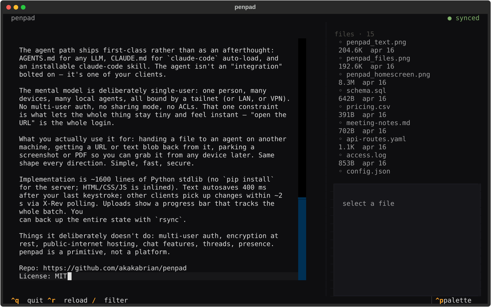
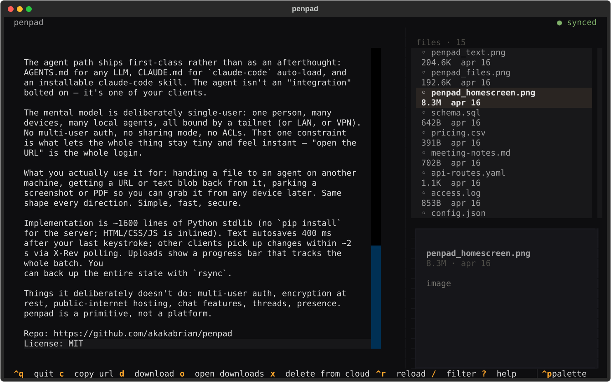
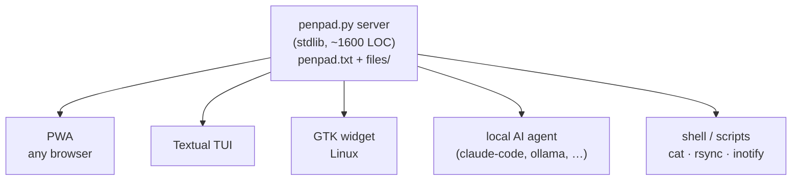

<p align="center">
  
</p>

# penpad

**A notes and file sharing app for you and your agents.**

Self-hosted, instant, no accounts. Drop a file on one device — it's
on another a beat later. Works between devices AirDrop won't even
talk to (Linux ↔ iPhone, Android ↔ Mac, headless server ↔ anything).
No iCloud, no subscription.

The data is just a text file and a folder on your disk; `cat`,
`rsync`, or `git` it however you want.

<p>
  
  
  
</p>
<p>
  
  &nbsp;
  
</p>

## Why I built it

Multiple machines, multiple agent harnesses, constant SSH and VNC
across them. Half the time the agent I'm talking to lives on a
different box than the one I'm sitting at. Moving a file or pasting
text between those contexts was death by a thousand cuts. penpad is
the one place all of them can see.

## What it is

A shared textarea and a shared folder, served by one small Python
process.



Three GUI clients (PWA, Textual TUI, GTK widget). **A local AI agent
on the same host is the fourth** — it reads and writes the file and
folder directly: no API key, no OAuth, no tool-use schema. Any
script you write does the same.

## What you'd use it for

- **Hand a file to an agent on another machine** — drop it; the agent
  picks it up.
- **Get a URL or text blob back** from the agent.
- **Move a screenshot from phone to laptop** in under a second.
- **Park something for yourself** to grab later from any device.
- **Hold a back-and-forth with a local agent** by appending lines.
  (Not a chat app; just fits one in zero LOC.)

Same shape every direction. Simple, fast, secure.

## Mental model

**Single-user by design**: one person, many devices, many agents, all
on a tailnet (or LAN, or VPN). No multi-user auth, no sharing, no
ACLs. That constraint is what keeps it tiny and instant — security
is the network layer, and "open the URL" is the whole login.

If you want multi-user, encryption-at-rest, or public hosting, use
something else. penpad is a primitive, not a platform.

## How it feels

Typing saves 400 ms after your last keystroke. Other clients pick up
changes within ~2 s via an `X-Rev` poll. Uploads stream with a batch
progress bar. No "save" button, no "sync now", no conflict modal —
it behaves like the same textarea is open on every device.

## Requirements

- **Server / TUI / PWA** — Python 3.10+. No other deps for the
  server itself.
- **Widget** — Linux + GTK 3 + WebKit2 4.1.

## Quick start

```sh
git clone https://github.com/akakabrian/penpad.git ~/penpad
cd ~/penpad
python3 penpad.py
```

Open `http://<host>:8767/`. Data lives in `~/penpad/penpad.txt` and
`~/penpad/files/`.

### As a systemd user service

```sh
mkdir -p ~/.config/systemd/user
cp packaging/penpad.service ~/.config/systemd/user/
systemctl --user daemon-reload
systemctl --user enable --now penpad.service
```

### TUI

```sh
python3 -m venv ~/penpad/.venv
~/penpad/.venv/bin/pip install -r requirements.txt
printf '#!/usr/bin/env bash\nexec %s/penpad/.venv/bin/python %s/penpad/tui.py "$@"\n' "$HOME" "$HOME" > ~/.local/bin/penpad
chmod +x ~/.local/bin/penpad
```

```sh
penpad                                         # local
PENPAD_URL=https://host.example.com penpad     # remote
```

### Widget (Linux/GTK)

```sh
sudo apt install python3-gi gir1.2-gtk-3.0 gir1.2-webkit2-4.1
cp packaging/penpad-widget.desktop ~/.config/autostart/
```

Pinned to the bottom-right after next login. Drag files to upload;
click to raise; minus button → pen-dot, click to expand.

### HTTPS without going public

```sh
tailscale serve --bg --https=443 http://localhost:8767
```

Real Let's Encrypt cert on a private `*.ts.net` name, reachable only
from your tailnet.

## Using penpad with AI agents

Agents read and write the data directly — no API to wire up. Three
docs ship in the repo so the agent path works out of the box:

- **[AGENTS.md](AGENTS.md)** — universal reference (locations,
  conventions, HTTP API, examples).
- **[CLAUDE.md](CLAUDE.md)** — repo-specific instructions auto-loaded
  by `claude-code`.
- **[.claude/skills/penpad/](.claude/skills/penpad/)** — installable
  Claude Code skill so Claude knows about your penpad from any
  working directory:

  ```sh
  mkdir -p ~/.claude/skills && cp -r .claude/skills/penpad ~/.claude/skills/
  ```

  Then say things like "drop this in penpad" or "what's in my penpad."

## TUI keybindings

| key  | action                                  |
|------|-----------------------------------------|
| type | edit pad (autosaves after 400 ms)       |
| tab  | move focus between pad / files / filter |
| `/`  | filter files                            |
| `c`  | copy file URL to clipboard              |
| `d`  | download selected file to `~/Downloads` |
| `o`  | open `~/Downloads/` in file explorer    |
| `x`  | delete selected file from the server    |
| `^r` | reload state from server                |
| `?`  | help                                    |
| `^q` | quit                                    |

Pasting an absolute path while the files pane is focused prompts to
upload it. Pastes into the pad go in as text.

## Configuration

| var          | default                  | purpose                 |
|--------------|--------------------------|-------------------------|
| `PENPAD_URL` | `http://127.0.0.1:8767`  | which server to talk to |

Widget extras:

| var                | purpose                                       |
|--------------------|-----------------------------------------------|
| `PENPAD_ANCHOR`    | `bottom-right` / `bottom-left` / `top-right` …|
| `PENPAD_W`         | widget width (px)                             |
| `PENPAD_H`         | widget height (px)                            |
| `PENPAD_COLLAPSED` | collapsed pen-dot diameter                    |
| `PENPAD_MARGIN`    | gap from the screen edge                      |
| `PENPAD_ON_TOP`    | `1` to force keep-above                       |

Legacy `NOTEPAD_*` names still work as a fallback.

## HTTP API

| method | path                       | purpose                                          |
|--------|----------------------------|--------------------------------------------------|
| GET    | `/content`                 | read pad text (returns `X-Rev` header)           |
| POST   | `/save`                    | replace pad text                                 |
| GET    | `/files/`                  | list files (JSON)                                |
| GET    | `/files/<name>`            | fetch a file (supports `Range`)                  |
| GET    | `/files/<name>?download=1` | force `Content-Disposition: attachment`          |
| PUT    | `/files/<name>`            | upload a file                                    |
| DELETE | `/files/<name>`            | delete a file                                    |
| POST   | `/upload-uri`              | server-side copy from `file://` URIs (loopback)  |

## Security

**Designed for trusted networks — a LAN, VPN, or tailnet. Don't
expose it to the public internet.** No authentication; anyone who
can reach the port can read, write, and delete. That's the trade.

## Contributing

PRs welcome. Design rules:

- Server stays stdlib-only.
- All clients (PWA, widget, TUI) keep the same behavior for **copy
  URL / download / delete / upload**. Don't let them drift.
- Warm-dark palette is the visual identity (top of `penpad.py` and
  `tui.tcss`). Change it on purpose.
- Single-user by design — no multi-user auth, ACLs, or sharing modes.

## License

MIT — see [LICENSE](LICENSE).
